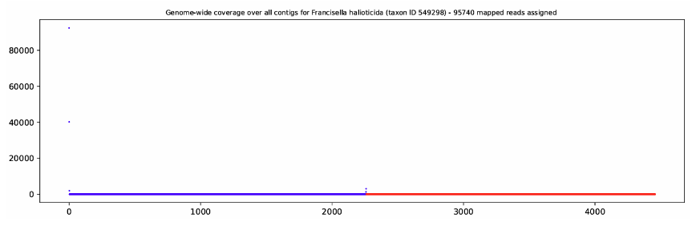

# MARS Metagenomics PDF Tools
#### M.A.R.S. - Microbiology in Agriculture Research Station
This is a collection of scripts for generating reports on metagenomics data produced by the analysis of the MetaMaps and MTSV mapping algorithms.
These scripts generate reports for Alpha diversity, Beta diversity, and direct read assignment at the organism level.

### **Data supported by workflow**
- [MetaMaps](https://github.com/DiltheyLab/MetaMaps) EM.lengthAndIdentitiesPerMappingUnit
- [MetaMaps](https://github.com/DiltheyLab/MetaMaps) EM.reads2Taxon
- [MTSV](https://github.com/FofanovLab/MTSv) with lookup file
- [BERTax](https://github.com/rnajena/bertax) Classification Results


### **Currently available reports**
- **Alpha Diversity Report**
  - Various plots related to alpha diversity metrics
  - Available for both [MetaMaps](https://github.com/DiltheyLab/MetaMaps/tree/master) and [MTSV](https://github.com/FofanovLab/MTSv)
- **Beta Diversity Report**
  - Various plots related to beta diversity metrics
  - Available for both [MetaMaps](https://github.com/DiltheyLab/MetaMaps/tree/master) and [MTSV](https://github.com/FofanovLab/MTSv)
- **Identity EM Report**
  - Optimized clone of plotIdentities_EM.R by the [MetaMaps](https://github.com/DiltheyLab/MetaMaps/tree/master) authors
  - Provides read metrics at the organism level
  - **Only available for [MetaMaps](https://github.com/DiltheyLab/MetaMaps/tree/master) EM Data**
- **Diverging Phylum**
  - Plots z-scores of phyla compared between samples
-  **Genus Tree**
    - Creates a treemap of the taxonomic tree down to the genus level
- **BERTax Summary**
    - Summarizes the superkingdom results of BERTax 
- **BERTax Confusion Matrix**
    - Creates confusion matrices at the superkingdom, phylum, and genus levels 
 
### Genus-level TreeMap Plots
- https://kamranaway.github.io/MARS-Metagenomics-PDF-Tools/241.html
- https://kamranaway.github.io/MARS-Metagenomics-PDF-Tools/247.html
- https://kamranaway.github.io/MARS-Metagenomics-PDF-Tools/325.html
- https://kamranaway.github.io/MARS-Metagenomics-PDF-Tools/337.html

## Getting Started
The workflow using these scripts is based on the data you have and what needs you have.

Either **you need biodiversity data** or **you need organism-specific data**.
As such, there will be two sections dedicated to either need. For biodiversity data, follow the [**Diversity Report**](#diversity-reports) path. For organism specific data, follow the [**Identity EM Report**](#identity-em-reports) path.

Regardless of what path you taketake, you'll need either [MTSV](https://github.com/FofanovLab/MTSv) or [MetaMaps](https://github.com/DiltheyLab/MetaMaps/tree/master) data.
This will require performing DNA sequencing to generate read data (often in FASTQ format), and then will require feeding that read data into either the MTSV or MetaMaps toolchain. You may additionally do processing using [BERTax](https://github.com/rnajena/bertax).

# Diversity Reports
Assuming you have processed read data with either one or both of MetaMaps and MTSV, you are ready to generate biodiversity reports. The first step in this process is to convert the data to local files for the diversity scripts to process.

### [Read Pickling]

We will use the terminal for this step. The argument '-a' provides the alias we will use for the pickle file.
- For MetaMaps
  - ```python ./pickle_mtsv_reads.py -meta <basename>.EM.reads2Taxon -a myData```
  
- or for MTSV
  - ```python ./pickle_mtsv_reads.py -mtsv <lookupname>.txt -a myData```
  
Note that **-mtsv** is for the mtsv output data and **--mtsvl** is for the lookup file that contains MetaMaps-style read hashes for each MTSV read. For information on how to generate a mtsv_metamaps_lookup_table please see [MTSV](https://github.com/FofanovLab/MTSv). The lookup file requirement exists for experimental filtering reasons and may be removed in the near future.

We should now have a a file in reads/myData.p which locally stores the analyzed read data for diversity analysis.

It's entirely possible that your chosen metagenomics tool in its given configuration is detecting outliers/false positives for read assignments, so it is **highly suggested** you use the plot_identities_em.py script first to evaluate the reliability of read assignments.

Some parameters from pickle_filtered_reads.py can be used to normalize or filter read data based on certain criteria.
**If you wish to normalize by the number of reads**, rarefaction and [SRS](https://github.com/vitorheidrich/SRS) are provided. Please configure R in your environment if you will be using [SRS](https://github.com/vitorheidrich/SRS).
- Rarefaction (to 1000 reads)
  - ```python ./pickle_meta_reads.py  -meta <basename>.EM.reads2Taxon -a myData -r 10000```
- [SRS](https://github.com/vitorheidrich/SRS) (to 1000 reads)
  - ```python ./pickle_meta_reads.py  -meta <basename>.EM.reads2Taxon -a myData -r 10000 -S```

### [Experimental SigBin Filtering]
An improvised filtering method exists to identify 'false positives' like the one below.

This is done by assigning concatenated reads into histogram bins and counting the number of bins. If the bin count is too small, all associated reads are discarded. 
- You can try out sigbin filtering with
  - ```python ./pickle_meta_reads.py  -meta <basename>.EM.reads2Taxon -a myData -B```

### [Generating Reports]
With our reads pickled, generating our reports will be very straightforward.
- [Alpha Diversity Report](#alpha_diversity_report.py)
  - ```python alpha_diversity_report.py -f <file>.p```
- [Beta Diversity Report](#beta_diversity_report.py) (Needs multiple files)
  - ```python beta_diversity_report.py -f <file1>.p <file2>.p <file3>.p```
- [Beta Diversity Report](#diverging_ph.py) (Needs multiple files)
  - ```python diverging_ph.py -f <file1>.p <file2>.p <file3>.p```
- [Beta Diversity Report](#beta_diversity_report.py) (Output opened in browser)
  - ```python genus_tree.py -f <file>.p```
  
Reports will be saved in the /reports/ directory directly outside of the folder the scripts are in.

### [BERTax Reports]
If you wish to test BERTax's performance, you should feed annotated .fasta files with IDs in the format of "kraken:taxid|2254|NZ_CP104742.1". You can feed one or more of the files produced by BERTax thereafter into a confusion matrix generating script to evaluate performance:
- ```python bertax_cm_matrix.py -f <file1>.p <file2>.p <file3>.p```
If you want a quick barplot summary of BERTax's classifications, you can feed BERTax's results into the following script:
- ```python bertax_summary.py -f <file>.p```

# Identity EM Reports
You should generate an Identity EM report if you need organism level analysis.
This can be useful for identity issues in either your sequencing or read analysis, or just directly identifying organisms in your data.

The original identity plotting script was written by the authors of [MetaMaps](https://github.com/DiltheyLab/MetaMaps). This version is translated into python and is optimized using hashmaps. A more direct python translation of the original script is available as plot_identities_em_old.py

All you need to get started here are the output files from MetaMaps named
1. \<basename\>.EM.lengthAndIdentitiesPerMappingUnit
2. \<basename\>.EM.contigCoverage
  
Both files should have the same basename.

You can generate an Identity EM Report as with
- ```python ./plot_identities_em.py -f .0001 <basename> -o myPlots```

The parameter ```-f``` provides a frequency such that all organisms who have a read count frequency below the provided value will not be plotted (useful to save time generating report).

**By default** the script will employ [SigBin](#experimental-sigbin-filtering) filtering. This can be disabled using ```-S```.
- ```python ./plot_identities_em.py -f .0001 -S <basename> -o myPlots```

# Scripts
### alpha_diversity_report.py
```
usage: alpha_diversity_report.py [-h] [-f FILE] [-s SEED] [-rt RANK_TYPE] [-rn RANK_NAME]

Alpha Diversity

options:
  -h, --help            show this help message and exit
  -f FILE, --file FILE  Pickle file name (default: None)
  -s SEED, --seed SEED  Seed for random number generator (default: 0)
```
### beta_diversity_report.py
```
usage: beta_diversity_report.py [-h] [-f FILES [FILES ...]] [-s SEED]

Beta Diversity

options:
  -h, --help            show this help message and exit
  -f FILES [FILES ...], --files FILES [FILES ...]
                        Files to compare (default: None)
  -s SEED, --seed SEED  Seed for random number generator (default: 0)
```
### diverging_ph.py
```
usage: diverging_ph.py [-h] [-f FILES [FILES ...]]

Diverging Phylum

options:
  -h, --help            show this help message and exit
  -f FILES [FILES ...], --files FILES [FILES ...]
                        Files to compare (default: None)
```
### genus_tree.py
```
usage: genus_tree.py [-h] [-f FILE]

Genus Tree

options:
  -h, --help            show this help message and exit
  -f FILE, --file FILE  Pickle file name (default: None)
```
### pickle_meta_reads.py
```
usage: pickle_meta_reads.py [-h] [-meta META_MAPS_FILE] [-p PRUNE_LEVEL] [-s SEED] [-a ALIAS] [-B] [-r RARE] [-S]

Takes MetaMaps reads and loads into a pickle file for analysis.

options:
  -h, --help            show this help message and exit
  -meta META_MAPS_FILE, --meta-maps-file META_MAPS_FILE
                        MetaMaps Reads2Taxon File (default: None)
  -p PRUNE_LEVEL, --prune-level PRUNE_LEVEL
                        Prune reads to given level (default: None)
  -s SEED, --seed SEED  Seed for random number generator (default: 0)
  -a ALIAS, --alias ALIAS
                        Alias for file (default: None)
  -B, --sig-bin         Enable sig-bin filtering (METAMAPS ONLY) (default: False)
  -r RARE, --rare RARE  Rareify to given read count (default: None)
  -S, --SRS             Enable SRS. Requires R to be set up in the current system's environment (default: False) 
```
### pickle_mtsv_reads.py
```
usage: pickle_mtsv_reads.py [-h] [-mtsv MTSV_FILE] [-mtsvl MTSV_LOOKUP_FILE] [-p PRUNE_LEVEL] [-s SEED] [-a ALIAS]
                            [-r RARE] [-S]

Takes MTSV reads and loads into a pickle file for analysis.

options:
  -h, --help            show this help message and exit
  -mtsv MTSV_FILE, --mtsv-file MTSV_FILE
                        MTSV File (default: None)
  -mtsvl MTSV_LOOKUP_FILE, --mtsv-lookup-file MTSV_LOOKUP_FILE
                        MTSV Lookup File (default: None)
  -p PRUNE_LEVEL, --prune-level PRUNE_LEVEL
                        Prune reads to given level (default: None)
  -s SEED, --seed SEED  Seed for random number generator (default: 0)
  -a ALIAS, --alias ALIAS
                        Alias for file (default: None)
  -r RARE, --rare RARE  Rareify to given read count (default: None)
  -S, --SRS             Enable SRS. Requires R to be set up in the current system's environment (default: False)  
```
### plot_identities_em.py
```

Python-MetaMaps Identity Plotter
        This script is based on plotIdentities_EM.R by the MetaMaps authors at https://github.com/DiltheyLab/MetaMaps 
        For help, use -h or --help

usage: plot_identities_em.py [-h] [-f MIN_FREQUENCY] [-o OUTPUT] [-I] [-S] [-v] classification_file_prefix

Plot MetaMaps Identity Results

positional arguments:
  classification_file_prefix
                        Prefix of the classification file

options:
  -h, --help            show this help message and exit
  -f MIN_FREQUENCY, --min-frequency MIN_FREQUENCY
                        Minimum frequency of taxon label to plot (default: 0.0)
  -o OUTPUT, --output OUTPUT
                        Output file name (default: )
  -I, --ignore-ids      Ignore ids in the file .ignoreids (default: False)
  -S, --skip-coverage-filter
                        Skip the coverage filtering step. Saves time if you already have a .ignoreids file. Will not  
                        generate an outlier pdf. (default: False)
  -v, --verbose         Verbose mode (default: False)
```

## Dependencies

* python 3
* matplotlib
* pandas
* scipy
* numpy
* ete3
* rpy2
* plotnine
* regex
* plotly
* kaleido


## Authors

Kamran Haq

## Acknowledgments
- [MTSV](https://github.com/FofanovLab/MTSv)
- [MetaMaps](https://github.com/DiltheyLab/MetaMaps)
- [SRS Algorithm](https://github.com/vitorheidrich/SRS)
- [BERTax](https://github.com/rnajena/bertax)
- The wonderful people at the CSU Chico MARS Lab

